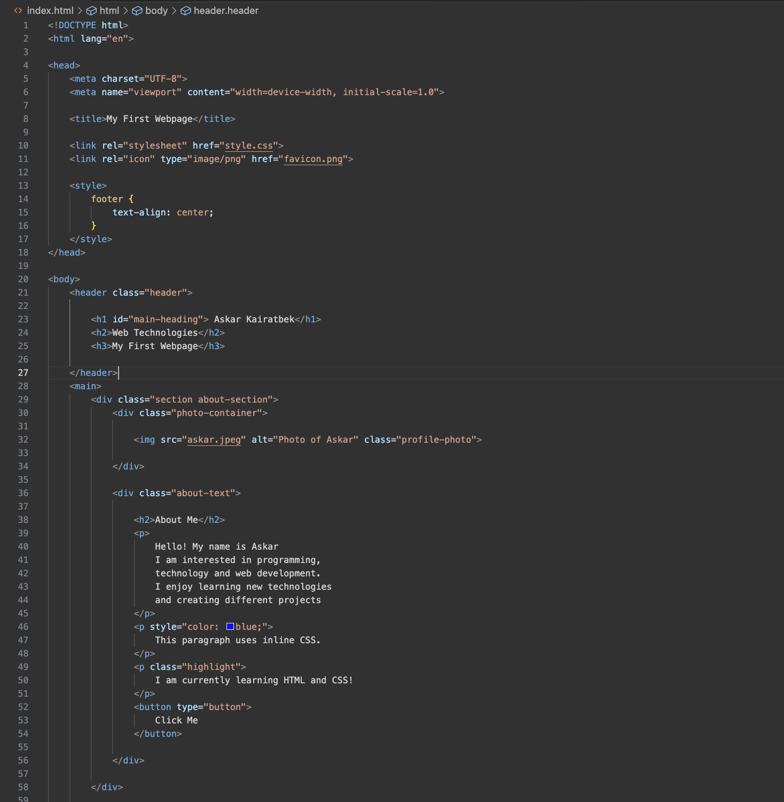
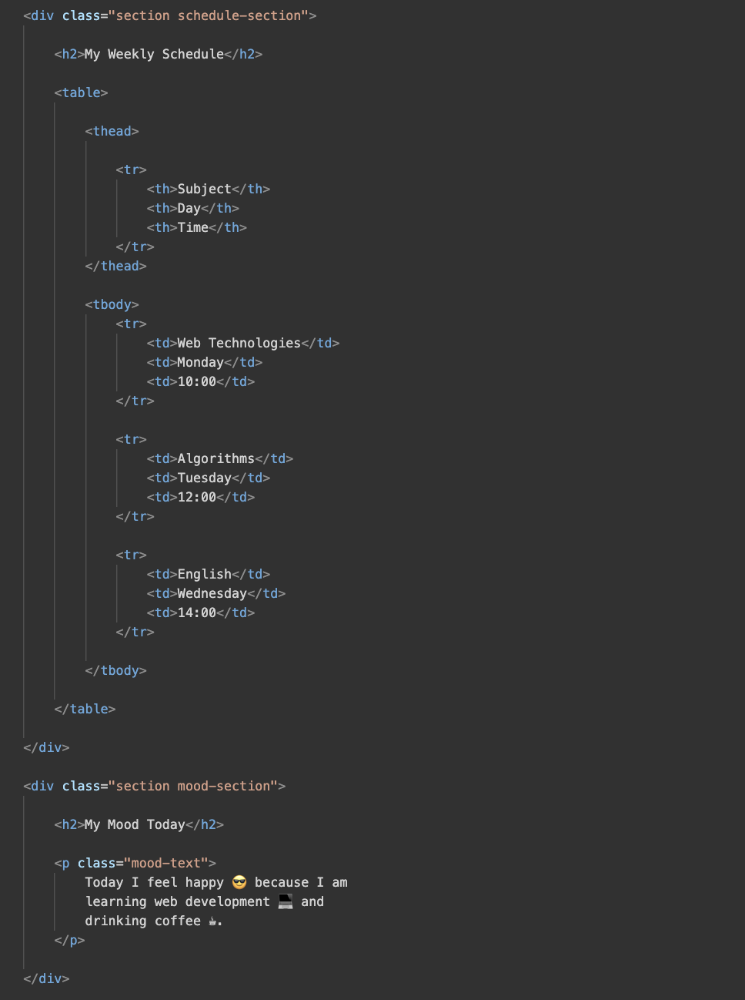
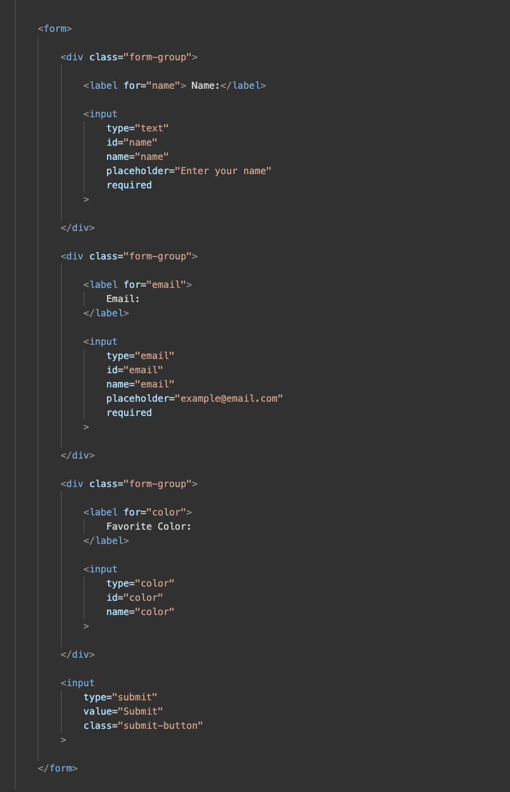
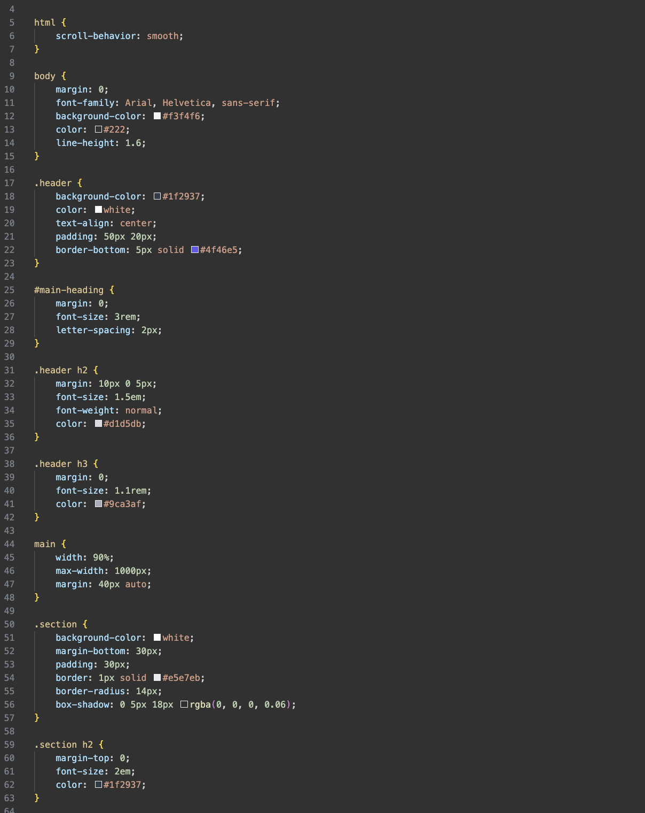
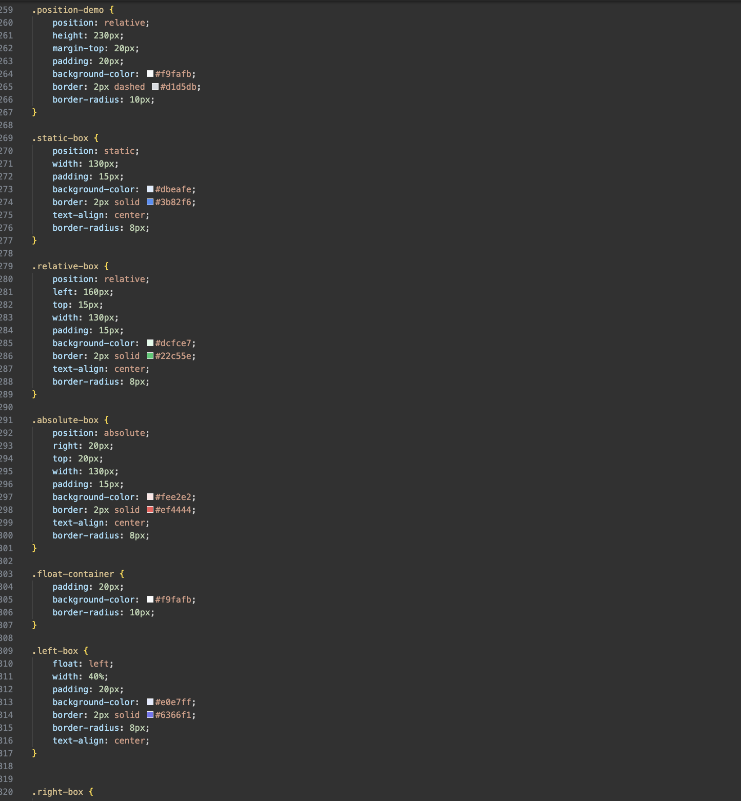
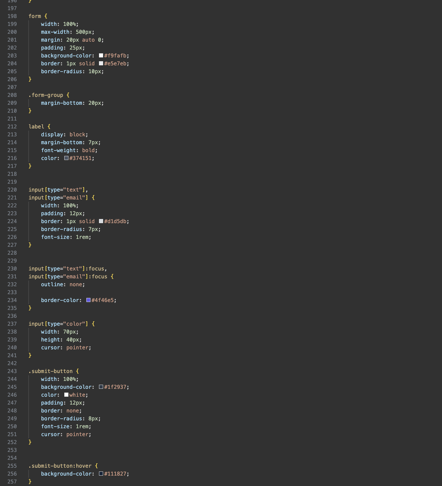
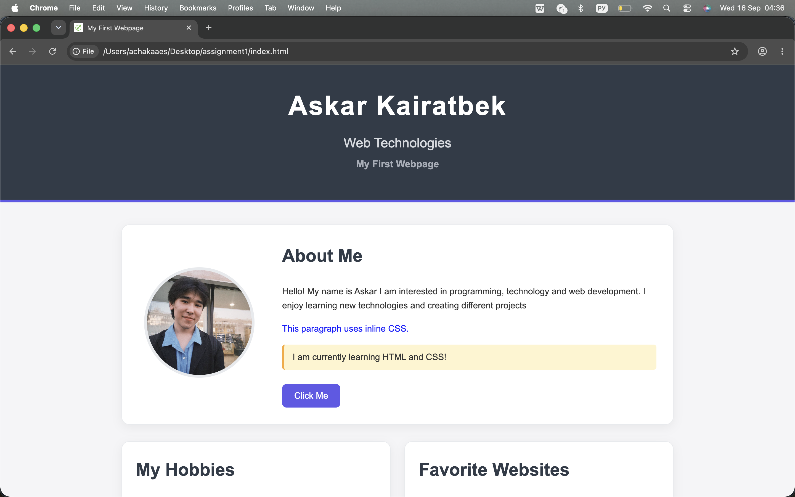

## Assignment 1
## Name: Askar Kairatbek
## Group: IT-2501

The objective of this assignment was to learn the basics of HTML and CSS and create a simple personal webpage.
During this assignment, I practiced working with HTML elements such as headings, paragraphs, lists, images, links, tables, buttons, and forms.
I also learned how to use CSS to style a webpage using colors, fonts, spacing, borders, positioning, and different selectors

Part 1: Introduction to HTML
## Step 0
So in this part, I created an index.html file and added the basic HTML structure:<!DOCTYPE html>, <html>, <head>, <title>, <body>
The title of the webpage is My First Webpage.

## Step 1
I used differet heading tags like: <h1>, <h2>, <h3>
I also added an About Me section using a paragraph 
.

## Step 2
I created An ordered list <ol> for my hobbies and unordered list <ul> for my favorite websites.

## Step 3
I added my profile image using the  tag.
I also added clickable links using the <a> tag

## Step 4
I added a simple Click Me button using the <button> tag.

Part 2: Intermediate HTML
## Step 5 
created a weekly schedule using an HTML table.
The table contains three columns: Subject, Day, Time

## Step 6
The webpage contains multiple sections that organize the content into a structured layout.

## Step 7
I added emojis to the webpage to describe my mood.
Example: 😎 💻 ☕

Step 8 
I created a form containing:
Name input
Email input
Favorite Color input
Submit button

Part 3 — Introduction to CSS
Steps 9–12: CSS Styling

I used inline, internal, and external CSS to style my webpage.
The main CSS styles are stored in the style.css file.

Steps 13–14 — CSS Selectors

I used:
Element selectors such as body
Class selectors such as .highlight
ID selectors such as #main-heading

The .highlight class is used for multiple elements, while #main-heading is used for one unique element.

Part 4: Intermediate CSS
Step 15: Favicon
I added a favicon to the webpage.

Step 16: Div Elements
I used 
 elements to organize the webpage into sections.

Step 17: CSS Box Model
I used margin, padding, and borders.

Step 18: CSS Positioning
I demonstrated static, relative, and absolute positioning.

Step 19: CSS Sizing
I used px, %, em, and rem units.

Step 20: Float and Clear
I used float: left, float: right, and clear: both.

# Final Website
## My final webpage contains:

Personal information
Profile image
Hobbies
Favorite websites
Weekly schedule
Mood section
Contact form
CSS positioning example
Float and clear example
Responsive design

During this assignment, I learned how HTML is used to create the structure of a webpage and how CSS is used to control its appearance.
I learned how to work with headings, paragraphs, lists, links, images, tables, forms, classes, IDs, CSS selectors, the box model, positioning, and different CSS units.
The most interesting part of the assignment was styling the webpage with CSS and creating a structured layout.
This assignment helped me better understand how HTML and CSS work together to create a complete webpage.
