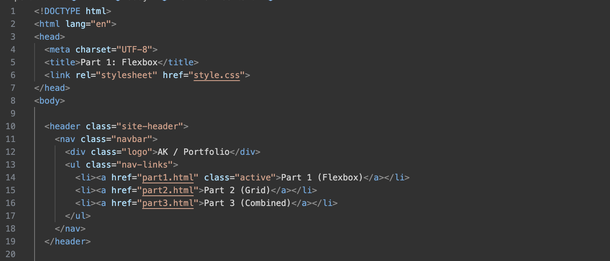
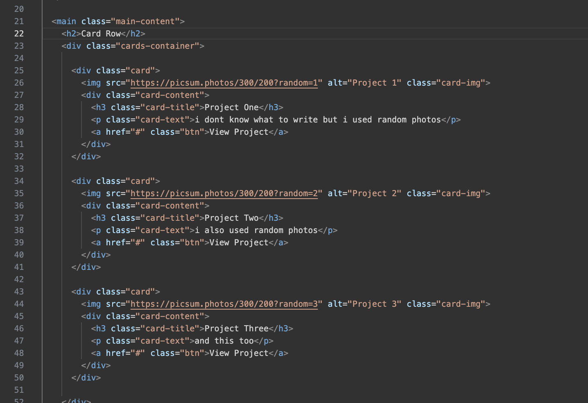
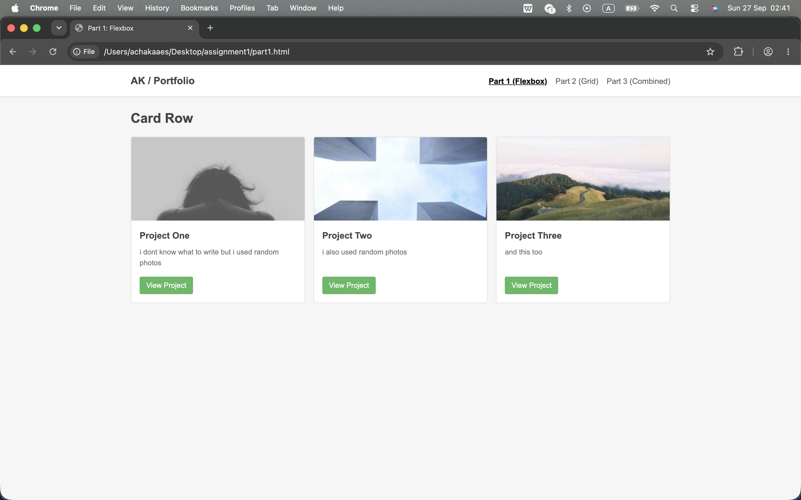
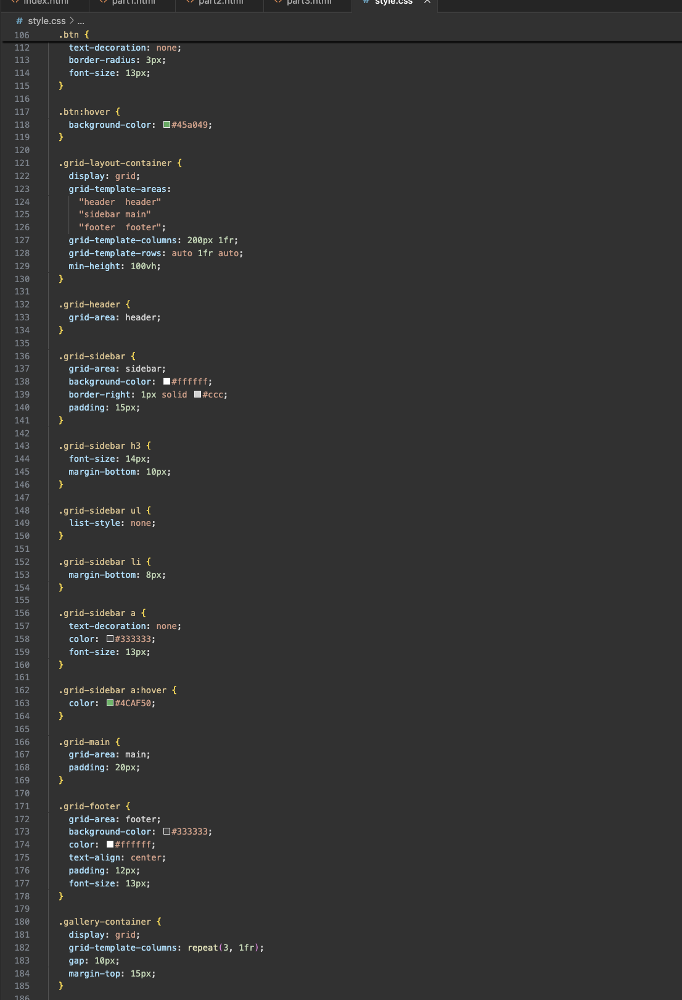
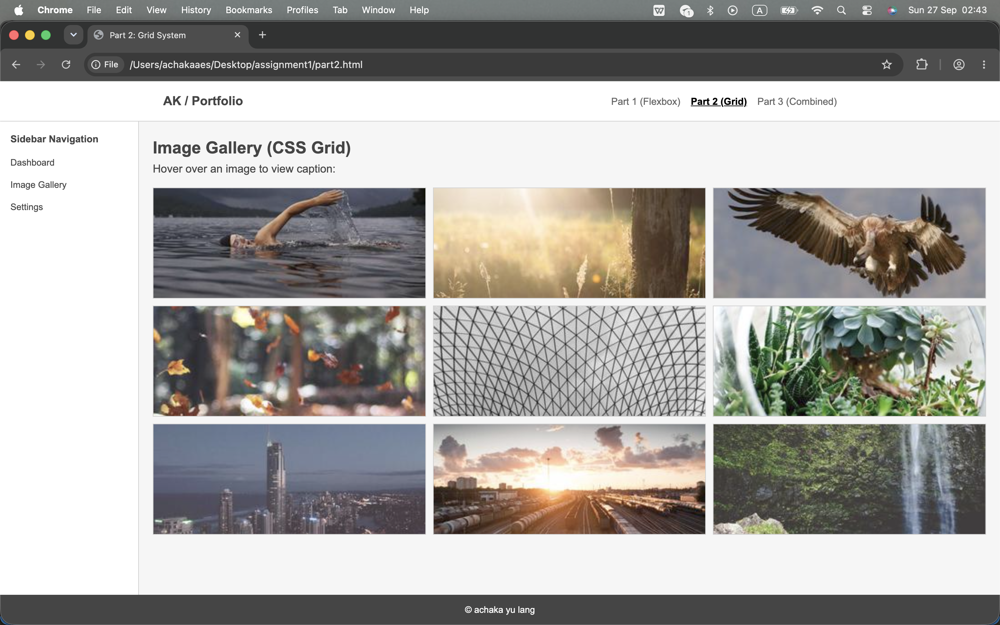
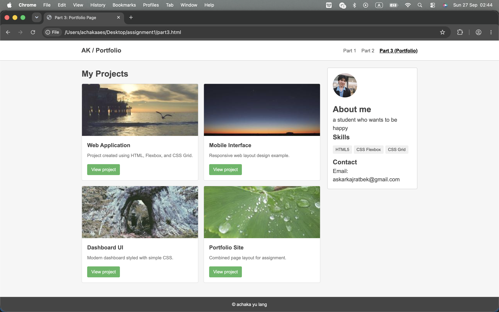
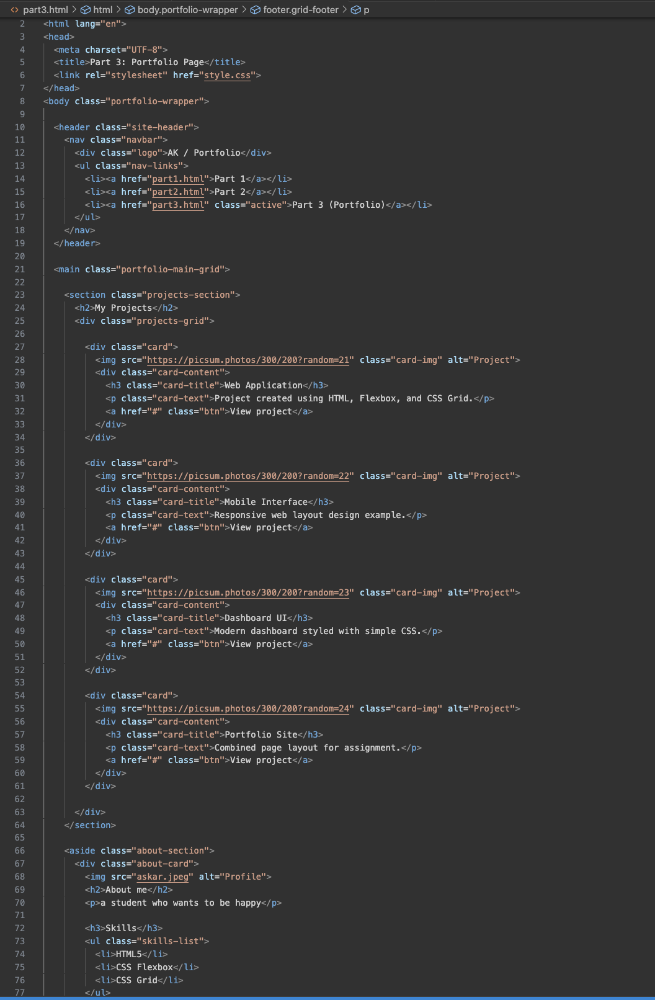

# Assignment 2
## Name: Askar Kairatbek
## group: IT-2501

## About the project

In this assignment, I created three pages to practise CSS Flexbox and Grid. I used Flexbox for navigation and cards, and Grid for the page layout, gallery, and portfolio section.

## Part 1: Flexbox

### Task 0 — Navigation Bar

I made a header with a logo on the left and navigation links on the right. I used Flexbox to align them and add space between the links.

### Task 1 — Card Row

I added three cards. Each card has an image, title, description, and button. The cards have equal height and a hover effect.

## Part 2: Grid

### Task 2 — Page Layout

I used CSS Grid to place the header, sidebar, main content, and footer on the page.

### Task 3 — Image Gallery

I created a gallery with nine images. The images are arranged in a grid, and a caption appears when I hover over an image.

## Part 3: Portfolio
I created a portfolio page with a header, projects, sidebar, and footer. The navigation uses Flexbox, and the projects section uses Grid.

### Task 4 — Portfolio Page

I created a portfolio page with a header, projects, sidebar, and footer. The navigation uses Flexbox, and the projects section uses Grid.

## Conclusion
This assignment helped me understand when to use Flexbox and when to use Grid. Flexbox was useful for arranging elements in a row, such as navigation links and cards. Grid made it easier to create the page layout and image gallery. I also practised adding spacing, alignment, and hover effects.
I started with the HTML structure for each page. Then I added CSS and adjusted the spacing and alignment. I checked the pages in a browser and fixed layout problems I noticed.
